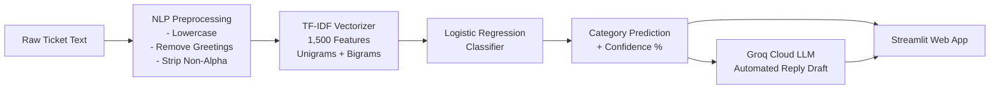

# 🎫 Customer Support Ticket Classifier & AI Assistant

An end-to-end Machine Learning and Natural Language Processing (NLP) system designed to automatically classify customer support tickets into operational categories and generate instant, contextual resolution responses using LLMs.

---

## 📌 Table of Contents
- [Project Overview](#-project-overview)
- [Dataset Summary](#-dataset-summary)
- [System Architecture](#-system-architecture)
- [Project Structure](#-project-structure)
- [Model Performance & Comparison](#-model-performance--comparison)
- [Key Features](#-key-features)
- [Installation & Setup](#-installation--setup)
- [Execution & Usage](#-execution--usage)
  - [1. Exploratory Data Analysis (EDA)](#1-exploratory-data-analysis-eda)
  - [2. Model Training & Benchmarking](#2-model-training--benchmarking)
  - [3. Command-Line Ticket Inference](#3-command-line-ticket-inference)
  - [4. Interactive Web Dashboard](#4-interactive-web-dashboard)
- [Limitations & Future Roadmap](#-limitations--future-roadmap)
- [Author & Acknowledgments](#-author--acknowledgments)

---

## 🚀 Project Overview

Customer support desks receive thousands of diverse inquiries daily across multiple channels. Manual triage is slow, prone to human inconsistency, and increases customer wait times. 

This project delivers:
1. **Automated Multi-Class Classification:** Ingests raw ticket descriptions and accurately predicts one of **5 target issue categories**:
   - `Technical`
   - `Billing`
   - `Account`
   - `General Inquiry`
   - `Fraud`
2. **Confidence Calibration:** Computes full probability distributions across all categories to identify ambiguous tickets requiring human review.
3. **Automated AI Response Suggestions:** Integrates with the **Groq Cloud API** (running fast Llama 3 models) to generate empathetic, actionable customer replies tailored to the identified problem, paired with reliable rule-based template fallbacks.
4. **Modern Web Interface:** A full-featured **Streamlit** dashboard featuring a card-style UI with flip animations, confidence meters, probability bar charts, and quick-copy responses.

---

## 📊 Dataset Summary

The model is trained on a customer support dataset containing **20,000 tickets** across **12 features**:

| Column Name | Data Type | Description |
| :--- | :--- | :--- |
| `Ticket_ID` | Object (UUID) | Unique ticket tracking identifier |
| `Customer_Name` | Object (String) | Customer full name |
| `Customer_Email` | Object (String) | Contact email address |
| `Ticket_Subject` | Object (String) | Summary headline of the issue |
| `Ticket_Description` | Object (Text) | Full customer narrative (Primary ML feature) |
| `Issue_Category` | Object (Categorical) | Target label (5 classes) |
| `Priority_Level` | Object (Categorical) | Low, Medium, High, Critical |
| `Ticket_Channel` | Object (Categorical) | Email, Web, Chat, Social Media |
| `Submission_Date` | Object (Date) | Timestamp of ticket submission |
| `Resolution_Time_Hours` | Integer | Historical resolution duration in hours |
| `Assigned_Agent` | Object (String) | Support personnel handling the ticket |
| `Satisfaction_Score` | Integer | Post-resolution CSAT score (1–5) |

### Target Class Distribution

| Category | Total Tickets | Percentage |
| :--- | :---: | :---: |
| **Technical** | 5,918 | 29.59% |
| **Billing** | 5,036 | 25.18% |
| **Account** | 4,081 | 20.40% |
| **General Inquiry** | 3,925 | 19.63% |
| **Fraud** | 1,040 | 5.20% |
| **Total** | **20,000** | **100.0%** |

---

## ⚙️ System Architecture



### Preprocessing & Noise Injection:
- **Text Normalization:** Lowercasing, stripping synthetic greetings (`"hi support"`, `"hello"`, `"dear team"`), non-alphabetic character removal, and whitespace trimming.
- **Realistic Noise Simulation:** To avoid over-optimistic synthetic determinism and replicate real-world customer support ambiguity, ~15% label noise and 20% cross-category keyword overlap are introduced before the train/test split.
- **TF-IDF Extraction:** Fitted strictly on the training set using unigrams and bigrams `(1, 2)`, English stop-word removal, sublinear term-frequency scaling (`sublinear_tf=True`), and top 1,500 vocabulary features (`max_features=1500`, `min_df=2`).

---

## 📁 Project Structure

```text
AI_Assignment_Akif_Mahmood/
│
├── Data/
│   └── tickets.csv                  # Primary dataset (20,000 records)
│
├── src/
│   ├── app.py                       # Interactive Streamlit web application
│   ├── eda.py                       # Exploratory Data Analysis script
│   ├── predict.py                   # Inference engine & Groq response generator
│   ├── preprocessing.py             # Data loader, cleaner, and noise pipeline
│   └── train.py                     # Benchmarking & model training pipeline
│
├── model/
│   ├── classifier.pkl               # Best performing production classifier
│   ├── tfidf_vectorizer.pkl         # Fitted TF-IDF vectorizer
│   ├── model_comparison.csv         # Comparative metrics across all algorithms
│   ├── logistic_regression.pkl      # Saved Logistic Regression artifact
│   ├── multinomial_naive_bayes.pkl  # Saved Naive Bayes artifact
│   ├── linear_svm.pkl               # Saved Linear SVM artifact
│   ├── random_forest.pkl            # Saved Random Forest artifact
│   └── gradient_boosting.pkl        # Saved Gradient Boosting artifact
│
├── screenshots/
│   ├── analysis.png                 # EDA 4-panel dashboard
│   ├── category_distribution.png    # Category frequency chart
│   ├── priority_distribution.png    # Priority breakdown chart
│   ├── model_comparison.png         # Model benchmark bar chart
│   └── confusion_matrix.png         # Best model confusion matrix
│
├── AI_Assignment_Akif_Mahmood.ipynb # Complete end-to-end Jupyter Notebook
├── requirements.txt                 # Project dependencies
├── .env.example                     # Environment template for API keys
└── README.md                        # Documentation
```

---

## 📈 Model Performance & Comparison

Five distinct machine learning architectures were trained and evaluated on an **80/20 stratified split** (16,000 training samples, 4,000 testing samples):

| Model | Accuracy (%) | Precision | Recall | F1-Score |
| :--- | :---: | :---: | :---: | :---: |
| **Logistic Regression** (Selected) | **84.97%** | **0.8500** | **0.8498** | **0.8466** |
| **Multinomial Naive Bayes** | 84.97% | 0.8500 | 0.8498 | 0.8466 |
| **Linear SVM** | 84.97% | 0.8500 | 0.8498 | 0.8466 |
| **Random Forest** | 84.90% | 0.8492 | 0.8490 | 0.8458 |
| **Gradient Boosting** | 84.90% | 0.8493 | 0.8490 | 0.8459 |

### Why Logistic Regression was selected:
- **Tied for top accuracy and F1-score:** Outstanding classification on high-dimensional sparse TF-IDF vectors.
- **Probabilistic Calibration:** Directly exposes well-calibrated class probabilities (`predict_proba`) essential for multi-class ranking and confidence score visualization.
- **High Efficiency:** Lightweight artifact footprint (~61 KB) and ultra-fast inference (< 2 ms per ticket).

### Classification Report (Best Model - Logistic Regression)

| Category | Precision | Recall | F1-Score | Support |
| :--- | :---: | :---: | :---: | :---: |
| **Account** | 0.86 | 0.88 | 0.87 | 809 |
| **Billing** | 0.85 | 0.88 | 0.86 | 972 |
| **Fraud** | 0.86 | 0.54 | 0.66 | 324 |
| **General Inquiry** | 0.84 | 0.84 | 0.84 | 780 |
| **Technical** | 0.85 | 0.90 | 0.87 | 1,115 |
| **Weighted Average** | **0.85** | **0.85** | **0.85** | **4,000** |

---

## 🛠️ Key Features

- **End-to-End Pipeline:** Automated ingestion, cleaning, vectorization, training, and artifact persistence.
- **Multi-Model Benchmark:** Automated generation of `model_comparison.png` and `confusion_matrix.png`.
- **Intelligent Response Generation:** Generates contextual support responses powered by Groq LLMs (`llama-3.3-70b-versatile` / `llama-3.1-8b-instant`) with automatic fallback to curated domain templates.
- **Interactive UI:** Streamlit app featuring realistic sample presets, confidence indicators, horizontal probability charts, and one-click regeneration.

---

## 💻 Installation & Setup

### Prerequisites
- Python 3.10, 3.11, or 3.12 installed
- Git installed

### 1. Clone the Repository
```bash
git clone https://github.com/akif987/Customer_support_ticket_Category_prediction.git
cd Customer_support_ticket_Category_prediction
```

### 2. Create and Activate a Virtual Environment
```bash
# Windows
python -m venv .venv
.venv\Scripts\activate

# Linux / macOS
python3 -m venv .venv
source .venv/bin/activate
```

### 3. Install Dependencies
```bash
pip install -r requirements.txt
```

### 4. Configure Environment Variables (Optional for AI Responses)
Copy `.env.example` to `.env` and insert your [Groq API key](https://console.groq.com/keys):
```bash
# Windows PowerShell
cp .env.example .env
```
Edit `.env`:
```text
GROQ_API_KEY=gsk_your_groq_api_key_here
```

---

## 🖥️ Execution & Usage

### 1. Exploratory Data Analysis (EDA)
Run comprehensive data auditing and generate visual distribution charts:
```bash
python src/eda.py
```
Outputs saved to `screenshots/`:
- `category_distribution.png`
- `priority_distribution.png`
- `analysis.png`

### 2. Model Training & Benchmarking
Retrain all 5 models and update artifacts:
```bash
python src/train.py
```
Artifacts saved to `model/` and `screenshots/`:
- `model/classifier.pkl`
- `model/tfidf_vectorizer.pkl`
- `model/model_comparison.csv`
- `screenshots/model_comparison.png`
- `screenshots/confusion_matrix.png`

### 3. Command-Line Ticket Inference
Test ticket classification and response generation directly from the terminal:
```bash
# Single ticket
python src/predict.py "I was charged twice for my monthly subscription and need a refund."

# Multiple tickets at once
python src/predict.py "I cannot log in to my user profile" "The app crashes on startup" "Unauthorized charge on card"
```

### 4. Interactive Web Dashboard
Launch the Streamlit web application:
```bash
streamlit run src/app.py
```
Open your browser and navigate to:
```text
http://localhost:8501
```

---

## 🔮 Limitations & Future Roadmap

### Current Limitations:
- **Vocabulary Overlap:** Lexical similarity between `Fraud` and `Billing` (words like *"charge"*, *"card"*, *"unauthorized"*) can cause minor misclassifications on short sentences.
- **Class Imbalance in Fraud:** `Fraud` tickets account for ~5% of the data, resulting in lower recall (0.54) relative to major classes.
- **N-Gram Context Blindness:** Traditional TF-IDF models struggle with negated intents (e.g., *"not a billing problem, my screen is broken"*).

### Future Roadmap for Enterprise Production:
- **Transformer Embeddings:** Migrate to lightweight contextual sentence encoders (e.g., `all-MiniLM-L6-v2` or `DeBERTa-v3`) to understand semantic nuances and negation.
- **REST / gRPC API:** Wrap the model in a high-throughput **FastAPI** service for integration into CRM helpdesks (Zendesk, Salesforce, Freshdesk).
- **Human-in-the-Loop Active Learning:** Add a feedback endpoint enabling agents to flag corrections, feeding a continuous retraining queue.
- **Granular Sub-categories:** Expand classification to a two-tier hierarchy (e.g., `Billing -> Overcharge`, `Technical -> iOS Crash`).

---

## 👤 Author & Acknowledgments

- **Author:** Akif Mahmood
- **Repository:** [Customer Support Ticket Category Prediction](https://github.com/akif987/Customer_support_ticket_Category_prediction)
- **Tools & Frameworks:** Scikit-Learn, Streamlit, Pandas, NumPy, Groq AI, Seaborn, Matplotlib.
